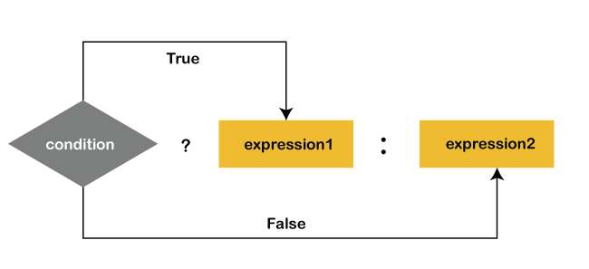

<h1 style="text-align:center;">Lesson 8 </h1>

- If condition
  - if else
  - else if

- Switch case
- Conditional (`ternary`) operator


<br><br>

# if else

```
if (Truthy/Falsy) {
  console.log("Truthy");
} else {
  console.log("Falsy");
}
```

<br><br>

# else if

```
if (condition1) {
  //  block of code to be executed if condition1 is true
} else if (condition2) {
  //  block of code to be executed if the condition1 is false and condition2 is true
} else {
  //  block of code to be executed if the condition1 is false and condition2 is false
}
```

<br><br>

## Block schema of "`if else`, `else if`, `else`"


<br><br>

# Switch case

```
switch(expression) {
  case x:
    // code block
    break;
  case y:
    // code block
    break;
  default:
    // code block
}
```
<br>

## Block schema of "switch case"


<br><br>

# Conditional (`ternary`) operator

```
condition ? expressionIfTrue : expressionIfFalse;
```

## Block schema of "Conditional ternary"

