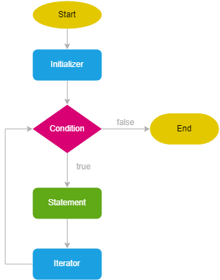
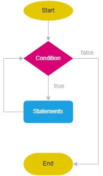
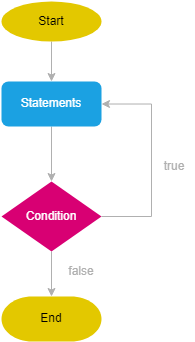
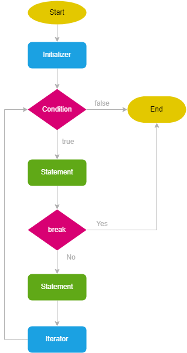
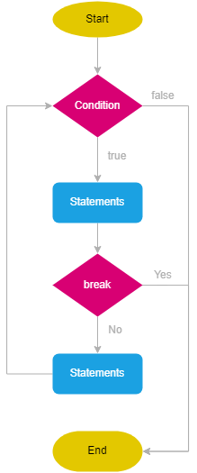
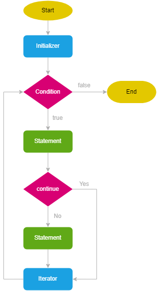

<h1 style="text-align:center;">Lesson 10 </h1>

## Loops

- Why loops
- Loop types
- `for` loop
- `while` loop
- `do while`
- `break` key word
- `continue` key word

<br><br>

# Why Loops

> JavaScript-da looplar (tsikllar) kodni bir necha marta bajarish uchun ishlatiladi. Looplar quyidagi holatlarda kerak bo‘ladi:<br>
Takroriy harakatlarni avtomatlashtirish<br>
Masalan, 1 dan 100 gacha bo‘lgan sonlarni ekranga chiqarish.<br>

<br><br>

# Loops Types

- for - parametrli
- while - sharti oldin tekshiriladigan
- do while - sharti keyin tekshiriladigan


<hr><br><br><br><br>

# For loop

<br>

- ## Syntax

```
for (initializer; condition; iterator) {
    // statements
}

// There always must be two semicolons;


for (let i = 1; i <= 10; i++) {
  console.log(i);
}

// 10 iteration - every process of loop;
// i - iterator variable;
```

<br>

- ## Block schema




<hr><br><br><br><br>

## Different cases in For Loop

<br>

- ## Without the initializer

```
let j = 1; // initilizer

for (; j <= 10; j++) {
  console.log(j);
}
```

<br>

- ## Without the condition

```
for (let j = 1; ; j++) {
  console.log(j);
	// condition
  if (j > 10) {
    break;
  }
}
```

<br>

- ## Without the iterator

```
for (let j = 1; j < 10;) {
  console.log(j);
	j += 1; // iterator
}
```

<br>

- ## Without the initializer, condition

```
let j = 1; // initilizer

for (;; j++) {
  console.log(j);

	// condition
  if (j > 10) {
    break;
  }
}
```

<br>

- ## Without the initializer, iterator

```
let j = 1; // initilizer

for (; j <= 10;) {

  console.log(j); // statements

  j++; // iterator
}
```
<br>

- ## Without the condition, iterator

```
let j = 1; // initilizer

for (;; j++) {

  // condition
  if (j > 10) {
    break;
  }

  console.log(j); // statements
}
```
<br>

- ## Without any expression

```
let j = 1; // initilizer

for (;;) {

  // condition
  if (j > 10) {
    break;
  }

  console.log(j); // statements

  j++; // iterator
}
```

<hr><br><br><br><br>

# while loop


```
while (condition) {
  // code block to be executed
}

let count = 1;

while (count < 10) {
    console.log(count);
    count +=2;
}
```

<br>

## Block schema



<hr><br><br><br><br>

# do while

```
do {
  statements;
} while (condition);

let count = 0;

do {
  console.log(count);
  count++;
} while (count < 5)
```


## Block schema




<hr><br><br><br><br>

# break keyword in For

```
for (let i = 0; i < 5; i++) {
  console.log(i);
  if (i == 2) {
    break;
  }
}
```

## Block schema




<br><br><br>

# break keyword in While


```
let i = 0;

while (i < 5) {
  i++;
  console.log(i);
  if (i == 3) {
    break;
  }
}
```
## Block schema




<hr><br><br><br><br>

# continue keyword in For

```
for (let i = 0; i < 10; i++) {
  if (i % 2 === 0) {
    continue;
  }
  console.log(i);
}
```

## Block schema




# continue keyword in while

```
let i = 0;
while (i < 10) {
  i++;
  if (i % 2 === 0) {
    continue;
  }
  console.log(i);
}
```

## Block schema


