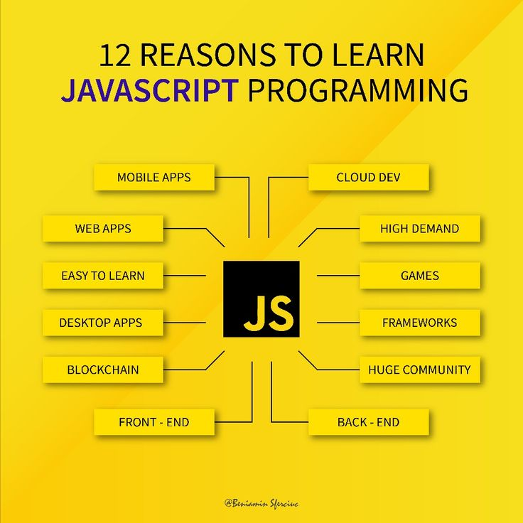

<h1 style="text-align:center;">Lesson 1 </h1>

> Assalamu alaykum JavaScript darslarimizga xush kelibsiz! Bugundan sizlar bilan JavaScriptni mukammal o’rganishni boshlaymiz!

- Dasturlash tillariga umumiy kirish.
- JavaScript tarixi.
- Nima uchun JavaScript.?
- JavaScript nima qiladi.?
- JavaScript versiyalari.
- JavaScript qayerda joylashtiriladi.?
- JavaScriptda kirish va chiqish.
- Sintaksis va izohlar.


<hr> <br> <br>

<h1>JavaScriptga kirish</h1>

> Dasturlash tillariga umumiy kirish.!
> Dasturlash tillari kompyuter dasturlarini yaratishda ishlatiladigan asosiy vositalardir. Hozirgi kunda keng qo'llaniladigan ba'zi mashhur dasturlash tillari quyidagilar: <br><br>
> C, C++ – bu tillar tizim dasturlari, o'yinlar, va murakkab ilovalar yaratishda qo'llaniladi.! <br>
> JavaScript, Java – JavaScript veb-ilovalar uchun, Java esa mobil ilovalar uchun keng ishlatiladi. <br>
> Python, PHP – Python sun'iy intellekt va tahlil uchun mashhur, PHP veb-saytlarni yaratishda qo'llaniladi.!

<hr> <br> <br>

<h1>JavaScript tarixi va versiyalari</h1>


## 1995 – JavaScriptning ishlabchiqilishi.!

> Brendan Eich – Netscape Communications kompaniyasi dasturchisi JavaScript’ni atigi 10 kun ichida yaratgan!
1995-yil sentabr oyida Netscape Navigator 2.0 brauzerida birinchi JavaScript versiyasi ishga tushdi.

- Dastlab, tilda Mocha nomi berilgan.
- Keyin LiveScript deb nomlandi.
- Oxir-oqibat, marketing maqsadida JavaScript deb ataldi.

<br><br>

## Nega 10 kunda yaratildi?

>O‘sha paytda veb sahifalar statik edi (faqat HTML va CSS bor edi).<br>
Netscape foydalanuvchilar bilan interaktiv aloqa qilish imkonini beradigan til yaratmoqchi edi.<br>
Brendan Eich tezda ishlay oladigan, oddiy, dinamik til yaratishi kerak edi.<br>

<br><br>

## 1996 – Microsoft va JScript
> Microsoft kompaniyasi Netscape bilan raqobatlashish uchun Internet Explorer 3.0 brauzeriga o‘zining JScript tilini qo‘shdi.<br>
>JScript va JavaScript bir xil emas edi – shuning uchun har ikkala brauzer uchun ham mos kod yozish qiyin bo‘lgan

<br><br>

## 1997 – JavaScript standarti (ECMAScript)

> ECMA (European Computer Manufacturers Association) JavaScript uchun standart ishlab chiqdi – ECMAScript (ES).

- ECMAScript 1 (ES1) → Birinchi JavaScript standarti <br>
- ECMAScript 2 (ES2) – 1998<br>
- ECMAScript 3 (ES3) – 1999 → Ko‘p yangi imkoniyatlar qo‘shildi (`try/catch, regex, switch-case`)<br>

<br><br>

## 2000–2010 – AJAX va vebning rivojlanishi

- 2005 – AJAX (Asynchronous JavaScript and XML) texnologiyasi paydo bo‘ldi! <br>
- AJAX tufayli veb-sahifalar sahifani yangilamasdan ma’lumot almasha boshladi.<br>
- Google Gmail va Google Maps kabi ilovalarda AJAX’ni ishlatdi.<br>

>Natijada: JavaScript faqat kichik skript tili emas, balki kuchli veb dasturlash tiliga aylandi!

<br><br>

## 2009 – Node.js va backend rivojlanishi

 >Ryan Dahl Node.js platformasini yaratdi – JavaScript server tomonda ham ishlay oladigan bo‘ldi!

Node.js’ning afzalliklari:<br>
- Serverda JavaScript kodini bajara oladi<br>
- Tez ishlaydi (V8 dvijokidan foydalanadi)<br>
- Asinxron (Event Loop texnologiyasi)

> Natijada: Endi JavaScript faqat frontend uchun emas, balki backend uchun ham ishlaydigan bo'lgan edi!

<br><br>

 ## 2015 – ECMAScript 6 (ES6) va zamonaviy JavaScript

>ECMAScript 6 (ES6) – JavaScript tarixidagi eng katta yangilanish!

 ES6 ning asosiy imkoniyatlari:
- `let / const` – yangi o‘zgaruvchi e’lon qilish usullari
- `Arrow functions` – qisqaroq funksiyalar: `()=>{}`
- `Classes (class)` – obyektlarga asoslangan dasturlashni osonlashtirdi
- `Template literals` – backtick (`) bilan string yaratish
- `Promises & async/await` – asinxron kodni boshqarish

> Natijada: ES6 dan keyin JavaScript yanada kuchli va qulay dasturlash tiliga aylandi!

<br><br>

## 2016 – Hozirgi zamonaviy JavaScript

> Har yili yangi ECMAScript versiyalari chiqmoqda:

- ES7 (2016) – `includes()`
- ES8 (2017) – `async/await`
- ES9 (2018) – `spread/rest` operatorlar
- ES10 (2019) – `flat(), trimStart()`
- ES11 (2020) – `BigInt`, `Optional Chaining` (`?.`)
- ES12 (2021) – `replaceAll()`, `WeakRefs`

 >Natijada: Har yili JavaScript yanada kuchli va qulayroq bo‘lib borayapti!

<br><br>

## Bugungi kunda JavaScript

- Frontend – React, Vue, Angular
- Backend – Node.js, Express.js
- Mobil ilovalar – React Native, Ionic
- Desktop dasturlar – Electron.js
- Sun’iy intellekt – TensorFlow.js
- O‘yinlar – Phaser.js, Three.js

> Natija: JavaScript endi faqat brauzer uchun emas, balki dunyoning eng muhim dasturlash tillaridan biri!


<hr> <br> <br>

<h1>Nima uchun JavaScript.?</h1>


>JavaScript – bu veb dasturlash uchun asosiy til, va hozirgi vaqtda eng mashhur dasturlash tillaridan biri. Quyidagi sabablar tufayli JavaScript juda muhim:


<b>Veb-saytlarni Interaktiv Qilish</b> <br>
✅ HTML va CSS faqat tuzilish va dizayn uchun ishlatiladi, lekin JavaScript ularni jonlantiradi.<br>
✅ JavaScript yordamida foydalanuvchi bilan interaktiv elementlar qo‘shish mumkin:<br>

- Tugmalarni bosganda harakat bajarilishi
- Formalarni tekshirish
- Modallar va pop-uplar yaratish
- Animatsiyalar va slayderlar qo‘shish

<br>

<b>Frontend va Backend Uchun Ishlatish Mumkin</b> <br>
✅ Oldin JavaScript faqat brauzerlarda ishlatilgan, lekin endi u server tomonda ham ishlaydi.<br>
✅ Frontend (klient tomoni)<br>

<br>

<b>React, Vue, Angular kabi framework va kutubxonalar bilan ishlaydi.</b> <br>
✅ Backend (server tomoni)
Node.js yordamida server dasturlash qilish mumkin.<br>

<br>

<b>Ko‘p Platformali Til</b> <br>
✅ JavaScript faqat veb uchun emas!<br>
✅ U mobil ilovalar (React Native), desktop dasturlar (Electron.js), o‘yinlar (Phaser.js) yaratishda ishlatiladi.<br>


<b>JavaScript tanlashning asosiy sabablarini qisqacha aytadigan bo‘lsak:</b><br>
✔️ Veb dasturlar uchun eng muhim til<br>
✔️ Frontend va backend uchun ishlaydi<br>
✔️ Mobil va desktop ilovalar yaratish mumkin<br>
✔️ Oson o‘rganiladi <br>
✔️ Tez va moslashuvchan<br>

Agar dasturlashga kirishmoqchi bo‘lsangiz, JavaScript – eng yaxshi boshlang‘ich til! 


<hr> <br> <br>

<h1>JavaScript nima qiladi?</h1>

> JavaScript veb-brauzerlar uchun asosiy dasturlash tili bo'lib, u quyidagi uchta asosiy qismdan iborat:

- ECMAScript – bu JavaScriptning standartlashtirilgan asosiy qismi bo'lib, `sintaksis` va asosiy `funksiya`larni belgilaydi. <br><br>

- DOM – bu HTML va XML hujjatlarining tuzilishini boshqaradi. U foydalanuvchi harakatlarini (hodisalar: `scroll`, `keyboard`) va `formalar` bilan ishlashni boshqaradi.

- BOM – bu brauzerning o'ziga xos elementlarini, masalan, `location`, `history`, va `notifications` kabi funksiyalarni boshqaradi.




<br><br>

JavaScriptni ishlatib, siz foydalanuvchi interfeyslarini o'zgartirish, animatsiyalar yaratish, va veb sahifalarni dinamik qilish imkoniyatiga ega bo'lasiz. Masalan:

- Toggle funksiyasi – elementlarni ko'rinishini o'zgartirish.
- Navbar-shrink – skroll qilganda navigatsiya panelini kichraytirish.
- Loading – yuklanish animatsiyalari yaratish.
- Carousel – animatsiyalar va slayderlarni boshqarish.
- Dark and light mode – saytning qorong'i va yorug' rejimlarini yaratish.

<hr> <br> <br>


<h1>JavaScript qanday ishlaydi.?</h1>

>JavaScript – bu brauzer va serverlarda ishlaydigan dasturlash tili. Uning ishlash jarayonini oddiy 4 bosqichga bo‘linadi:

1️⃣ JavaScript kodini brauzer yoki dvijok (engine) o‘qiydi <br>
2️⃣ Kod qatorma-qator ishlov beriladi va bajariladi<br>
3️⃣ Brauzer HTML va CSS bilan JavaScript’ni birlashtirib, natijani ko‘rsatadi<br>
4️⃣ Hodisalar (Events) yordamida JavaScript kod doimiy ishlashda davom etadi<br>

<br><br>

 ```
 1. JavaScript qanday ishlaydi? (Brauzer ichida)
JavaScript brauzer (Chrome, Firefox, Edge) ichida "JavaScript Engine" (dvijok) yordamida ishlaydi.
```

## Mashhur dvijoklar:

- Google Chrome → V8 Engine
- Firefox → SpiderMonkey
- Safari → JavaScriptCore
- Microsoft Edge → Chakra
>Bu dvijoklar JavaScript kodini tushunadi, uni bajaradi va brauzer bilan bog‘laydi.

<br><br>

```
2. JavaScript qanday bajariladi?
🔹 JavaScript interpreter va JIT kompilyator
JavaScript interpretatsiya qilinadigan til, ya’ni u kodni qatorma-qator bajaradi.
🚀 Lekin zamonaviy dvijoklar JIT (Just-In-Time) Compilation orqali tez ishlashini ta’minlaydi!
```

1️⃣ Brauzer JavaScript kodni oladi
2️⃣ Dvijok uni "Parsing" qilib, tokenlarga ajratadi
3️⃣ Tokenlar "Abstract Syntax Tree" (AST) ga aylantiriladi
4️⃣ AST bajarish uchun "Bytecode" ga o‘giriladi
5️⃣ Bytecode JIT yordamida tez ishlaydi!

> Shu sababli JavaScript juda tez ishlaydi!

<br><br>

```
3. JavaScript va DOM (Document Object Model)
JavaScript veb sahifani boshqarishi uchun DOM (Document Object Model) bilan ishlaydi.
```

>JavaScript <br>
HTML elementlarini o‘zgartirishi mumkin<br>
CSS uslublarini o‘zgartirish mumkin<br>
Foydalanuvchi bilan interaktiv aloqada bo‘lish

<br><br>

```
4. JavaScript qanday hodisalar bilan ishlaydi? (Event Loop)
JavaScript asinxron ishlash imkoniyatiga ega! Bu degani, u bir vaqtda bir nechta vazifalarni bajara oladi.
```

>Event Loop – bu JavaScript’da asinxron kodni boshqaradigan mexanizm.

🔹 Oddiy kod ishlash tartibi:<br>
1️⃣ JavaScript kodni bajaradi <br>
2️⃣ Agar kod ichida API yoki setTimeout bo‘lsa, uni Web API ga yuboradi<br>
3️⃣ Web API bajarilgandan so‘ng, Callback Queue orqali natijani qaytaradi<br>
4️⃣ Event Loop bu natijani olib, JavaScript kodiga qaytaradi<br>

<br><br>

```
5. JavaScript qaerda ishlaydi?
JavaScript faqat brauzerda emas! Turli joylarda ishlashi mumkin:
```

✅ Brauzer → Veb sahifalarni interaktiv qilish <br>
✅ Server (Node.js) → Backend dasturlash<br>
✅ Mobil ilovalar (React Native, Ionic) → iOS va Android ilovalar<br>
✅ Desktop ilovalar (Electron.js) → Windows, Mac, Linux dasturlari<br>
✅ O‘yinlar (Phaser.js, Three.js) → 2D va 3D o‘yinlar<br>
✅ IoT (Arduino, Raspberry Pi) → Qurilmalarni boshqarish<br>

<br><br>

## JavaScript qanday ishlaydi.?
✔ Brauzer dvijok (V8, SpiderMonkey) kodni o‘qiydi va bajaraydi<br>
✔ JavaScript DOM orqali HTML va CSS ni o‘zgartiradi<br>
✔ Event Loop asinxron kodni boshqaradi<br>
✔ Kod qatorma-qator bajariladi, lekin JIT uni tezlashtiradi<br>

>JavaScript tez, moslashuvchan va kuchli dasturlash til.!


<hr> <br> <br>

<h1>JavaScript qayerda joylashtiriladi?</h1>

> JavaScript kodlari HTML hujjatlarida uch xil usulda joylashtirilishi mumkin:

- Inline – JavaScript kodini to'g'ridan-to'g'ri HTML teglarida yozish.
- Internal – JavaScript kodini script teglar orasida HTML hujjatning ichida yozish.
- External – JavaScript kodini alohida .js faylga yozib, HTML hujjatga ulash.

<hr> <br> <br>

<h1>JavaScriptda kirish va chiqish</h1>

> JavaScriptda kirish va chiqish operatsiyalari quyidagicha amalga oshiriladi:

- Kirish: Foydalanuvchi ma'lumotlarini olish uchun `prompt` funksiyasi ishlatiladi.

- Chiqish: Ma'lumotlarni ekranga chiqarish uchun `innerHTML`, `document.write()`, `window.alert()`, `window.confirm()`, yoki `console.log()` funksiyalari ishlatiladi.!

<hr> <br> <br>

<h1>Sintaksis va izohlar</h1>

> JavaScriptda kodni to'g'ri yozish uchun sintaksisga e'tibor berish kerak:

- Izohlar: Kod ichida tushuntirish yoki izohlar yozish uchun bir qatorli izohlar `//` va ko'p qatorli izohlar `/* ... */` ishlatiladi.

- Nuqtali vergul: Har bir JavaScript bayonoti (statement) oxirida ; belgisi qo'yiladi.

- Bloklar: Kodni guruhlash uchun `{}` figurali qavslar ishlatiladi.

- Ifodalar: Misol uchun, 3 + 4 bir ifoda (expression) bo'lib, natijasi 7 bo'ladi.
