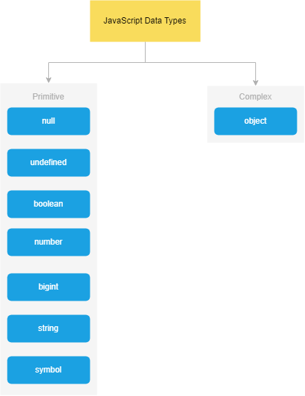

<h1 style="text-align:center;">Lesson 3 </h1>

- Data types

  - primative
  - complex

- Arithmetic (mixture)

<br><br>

# Data types

  

<hr><br><br>

# Primitive types

- ## Number

```
console.log(Infinity, typeof Infinity);

console.log(12 / 0);

console.log(NaN, typeof NaN); // Not a Number

console.log(0 / 0);

console.log(0b10110); // binary

console.log(0o4762); // octal

console.log(0xa6b8f); // hex

console.log(0.68); // float

console.log(0.1 + 0.2); // js bug

console.log(12e5); // exponential

console.log(12e-5);

console.log(123_456_789); // numeric_separator

```

<br><br>

- ## string

```
let doubleQuote = "JavaScript";

let singleQuote = 'typeScript';

let backTicks = `ReactJs`;
```

<br><br>

- ## undefined

```
let firstName;

console.log(firstName);

```

<br><br>

- ## null

```
let selected = null;

console.log(typeof selected) // javascript bug
```

<br><br>

- ## Boolean

```
let isMarried = false;

let isSingle = true;
```

<br><br>

- ## bigint

```
let b1 = 1231232312321312321321n;

let b2 = BigInt(234343413213123123);
```

<br><br>

- ## symbol

```
let s1 = Symbol();
let s2 = Symbol();

console.log(s1 === s2);
```

<hr> <br> <br> <br> <br> <br>

# Complex ( reference , non-primitive)

- ## array

```
let arr = [ 1, 5, 'a', null, 'bcd', undefined ]

```

<br><br>

- ## object

```
let person = {
	firstName: "John",
	lastName: "Doe",
	age: 21
}
```

<hr> <br> <br> <br> <br> <br>

# Arithmetic (mixture)

| syntax              | res |
| ------------------- | --- |
| num + str           | str |
| num /str(num)       | num |
| str(num) / str(num) | num |
| others              | NaN |


<hr> <br> <br> <br> <br> <br>